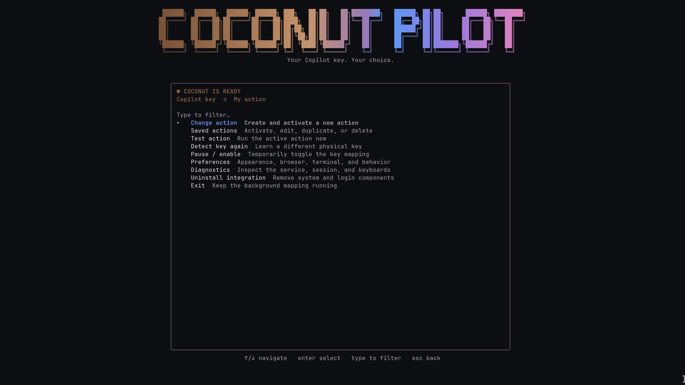
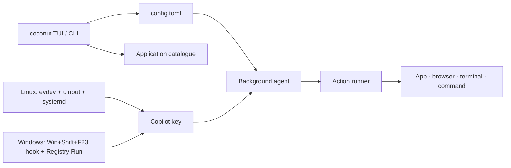

# 🥥 COCONUT PILOT

> ## ***Your keyboard, your shortcuts.***
>
> Turn the Copilot key into the shortcut **you** actually need.

<p>
  
  
  
  
</p>

**COCONUT PILOT** is a keyboard-first terminal app for assigning the physical
Copilot key to an installed application, a browser and website, a file or
folder, a terminal, or a command such as `npm run start`. Its public command is
simply **`coconut`**.

<p align="center">
  
</p>

```text
    C O C O N U T   →   P I L O T

    Copilot key  →  Spotify
    Copilot key  →  https://localhost:3000
    Copilot key  →  npm run start
    Copilot key  →  your terminal
```

## ✨ What it does

| Choose | Coconut can open |
| --- | --- |
| **An installed app** | Spotify, VS Code, Discord, Settings, or any registered desktop application |
| **A website** | A URL in the browser you select, with quick templates for GitHub, YouTube, Wikipedia, localhost and more |
| **A command** | `npm run start`, `npm run dev`, an executable with arguments, or an explicit shell command |
| **A place** | A file, folder, terminal, or your default browser |

- Detects and confirms the physical key during setup.
- Finds installed apps automatically.
- Runs in the background after setup and starts again at login.
- Shows key-to-launch timing in `coconut status`.
- Uses **Backspace + Escape + Enter** as an emergency pause shortcut.
- Keeps the large COCONUT PILOT banner visible while navigating the TUI.

## 🚀 Install

Choose a direct download for your operating system. Each release also includes
versioned archives, a source archive and `SHA256SUMS` for verification.

### Linux

**[Download Coconut Pilot for Linux (x86_64)](https://github.com/Memoli08/coconut-pilot/releases/latest/download/coconut-pilot-linux-x86_64.tar.gz)**

Download `coconut-pilot-linux-x86_64.tar.gz`, then:

```sh
tar -xzf coconut-pilot-linux-x86_64.tar.gz
cd coconut-pilot-*-linux-x86_64
./install.sh
```

Open a new terminal and start Coconut:

```sh
coconut
```

The installer puts the user command in `~/.local/bin`. During setup Coconut
asks for `sudo` only when it needs to install the Linux input service.

### Windows 10 / 11

**[Download Coconut Pilot for Windows (x86_64)](https://github.com/Memoli08/coconut-pilot/releases/latest/download/coconut-pilot-windows-x86_64.zip)**

Download `coconut-pilot-windows-x86_64.zip`, extract it, open
PowerShell in the extracted folder, then run:

```powershell
powershell -ExecutionPolicy Bypass -File .\install.ps1
```

Open a new PowerShell window and start Coconut:

```powershell
coconut
```

The installer copies `coconut.exe` into `%LOCALAPPDATA%\CoconutPilot` and adds
that directory to your user `PATH`. It does not need administrator permission.
The execution-policy override applies only to the installer process.

## 🎯 First run

`coconut` starts the setup wizard automatically when no mapping exists.

```text
┌──────────────────────────────────────────────────────────────┐
│                  C O C O N U T   P I L O T                   │
│          Turn the unused Copilot key into something useful.  │
├──────────────────────────────────────────────────────────────┤
│  1. Press Copilot once                                        │
│  2. Press it once more to confirm                             │
│  3. Choose what it should launch                              │
│  4. Save and enable                                           │
└──────────────────────────────────────────────────────────────┘
```

Use **↑ / ↓**, **Enter**, **Esc**, Page Up/Page Down and typing to filter
lists. Closing the interface leaves an enabled mapping active.

Afterwards, use `coconut` for the dashboard or go straight to setup with:

```sh
coconut setup
```

## 🖥️ Platform support

| | Linux | Windows |
| --- | --- | --- |
| Copilot input | Physical keyboard events through `evdev` + `uinput` | Standard `Win + Shift + F23` Copilot chord through a low-level keyboard hook |
| Background integration | Root-owned systemd input service + user agent | Per-user background agent |
| Login startup | XDG autostart; Hyprland integration where applicable | Current-user Registry `Run` entry |
| App discovery | Desktop registrations via GLib/GIO | Start Menu `.lnk`, `.url` and `.exe` entries |
| Settings | `~/.config/coconut/config.toml` by default | `%APPDATA%\CoconutPilot\config.toml` |
| Logs and timing | `~/.local/state/coconut` by default | `%LOCALAPPDATA%\CoconutPilot` |

### Linux requirements

Coconut supports normal desktop installations of Arch/CachyOS, Debian, Ubuntu,
Fedora, openSUSE and similar distributions when they provide:

- `systemd` and `logind`
- a local X11 or Wayland graphical session on `seat0`
- `/dev/input` and `/dev/uinput`
- `sudo` for installing or repairing the input service

Run this before setup if you are unsure:

```sh
coconut doctor
```

Containers, remote desktop sessions, systems without physical input devices,
and non-systemd installations such as a default Alpine/OpenRC system are not
supported by the Linux input backend.

### Windows notes

Windows support targets the standardized Copilot signal: **Win + Shift + F23**.
No keyboard driver or administrator permission is required. The hook consumes
the F23 event when the two modifiers are held; Windows has already seen the
modifier presses, which is expected for a user-level hook.

## 🧭 Commands

```text
coconut                     Open setup or the dashboard
coconut setup               Learn the key and select an action
coconut apps --json         List discovered applications
coconut browsers --json     List discovered browsers
coconut actions             Manage saved actions
coconut preferences         Change appearance and behavior
coconut status --json       Show mapping, health and last launch timing
coconut test                Launch the active action now
coconut detect --json       Learn a key without changing the action
coconut enable              Enable the mapping
coconut disable             Pause the mapping
coconut doctor --json       Show environment diagnostics
coconut uninstall           Remove startup and input integration
```

`coconut test` is useful when testing an action before assigning it to the
Copilot key. Public commands work without an interactive terminal when they
print JSON or diagnostics.

## 🧱 Architecture



The TUI, action model, configuration, action runner and application selection
are shared Rust code. Only keyboard capture, app enumeration and login startup
use platform-specific adapters.

### Linux flow

1. The privileged input service watches the learned physical keyboard chord.
2. It forwards ordinary events and only consumes the selected mapping.
3. The normal-user agent receives a trigger through a local Unix socket.
4. The agent launches the selected action in the active desktop session.

### Windows flow

1. The user-session agent installs a low-level keyboard hook.
2. It detects `Win + Shift + F23`, blocks the F23 event and reads the active action.
3. It opens the selected app, browser, path, terminal or command as the current user.
4. The Registry startup entry restores the agent at sign-in.

## 🔒 Security and behavior

- Linux keyboard capture is isolated in a root-owned service. Actions run as
  the normal desktop user.
- The Linux agent checks the active, unlocked graphical session before launch.
- Coconut does not store keyboard event streams.
- URL actions accept only HTTP/HTTPS URLs and reject embedded credentials.
- Commands preserve executable, arguments, working directory and environment
  separately. Shell interpretation is used only for the explicit shell action.
- A process lock avoids launching an opted-in command twice.
- App discovery follows desktop or Start Menu registrations. An arbitrary
  executable can still be selected manually.

## 🤝 Community

- Read [CONTRIBUTING.md](CONTRIBUTING.md) before opening a pull request.
- Use the GitHub issue forms for reproducible bugs and feature requests.
- Read [SECURITY.md](SECURITY.md) before reporting a vulnerability.
- Project participation follows the [Code of Conduct](CODE_OF_CONDUCT.md).
- General help is collected in [SUPPORT.md](SUPPORT.md).

## 🛠️ Build from source

### Linux

Install stable Rust, a C linker, `pkg-config`, and GLib/GIO development headers:

```text
Arch/CachyOS:  base-devel glib2
Debian/Ubuntu: build-essential pkg-config libglib2.0-dev
Fedora:        gcc pkgconf-pkg-config glib2-devel
```

Then build and run:

```sh
cargo build --release --locked
./target/release/coconut
```

### Windows

Install stable Rust with the **MSVC** toolchain and Visual Studio's **Desktop
development with C++** workload. Then, from PowerShell:

```powershell
cargo build --release --locked
.\target\release\coconut.exe
```

## ✅ Validation

```sh
cargo fmt --check
cargo clippy --locked --all-targets -- -D warnings
cargo test --locked
cargo check --locked --target x86_64-pc-windows-gnu --all-targets
cargo check --locked --target x86_64-pc-windows-msvc --all-targets
```

The release workflow builds Linux and Windows packages. Its Windows job also
starts the compiled agent briefly, so a failure to install the native keyboard
hook fails the build.

For a release, test a physical Copilot key on Windows 10/11 and on representative
Linux X11/Wayland desktops. Verify typing, modifiers, sleep/wake, logout/login,
app launch, emergency pause and uninstall.

## 📦 Packaging and releases

| Artifact | Produced by |
| --- | --- |
| Linux x86_64 archive | `packaging/release-bundle.sh` |
| Debian/Ubuntu package | `packaging/build-deb.sh` |
| Vendored source archive | `packaging/source-dist.sh` |
| Windows x86_64 ZIP | `packaging/release-bundle.ps1` |

Pushing a version tag runs `.github/workflows/release.yml` and publishes the
release assets with checksums. Update `version` in `Cargo.toml` before tagging.

```sh
git tag v0.1.0
git push origin v0.1.0
```

## 🧯 Troubleshooting

```sh
coconut doctor
coconut status
```

On Linux, inspect the input service with:

```sh
journalctl -u coconut-input.service
```

If typing becomes unusable, use the emergency shortcut **Backspace + Escape +
Enter**. On Linux, `sudo systemctl stop coconut-input.service` immediately
releases the input integration. On Windows, run `coconut disable` or use the
same emergency shortcut.

## License

MIT — see [LICENSE](LICENSE).

---

<p align="center">Made with 🥥 and of course AI :D</p>
